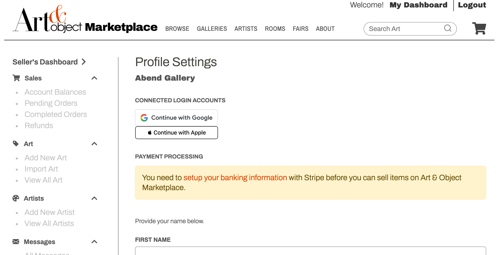

# Welcome
Once you have your Art & Object Marketplace login, there are a few steps you'll need to do before you can start selling on the site:

## [Edit your profile](https://www.artandobject.shop/seller/settings)
From the profile page, you can add connected login accounts from Google or Apple to streamline future logins. After you those setup, if you ever want to disconnect those accounts, you'll also come to this page to remove them.

Also on this page, you can update your name, email, password, and email preferences. Be sure you specify your contact information (email and name) is up to date because once an item is sold and if you are using our shipping partner, they will be reaching out to you via that contact information.

Most importantly on this page is your financial account, which is managed by Stripe. You will not be able to publish or sell items without this information, so it's important you set this up as soon as possible. If you already have a Stripe account, it's a simple matter of clicking the link and logging in. If you don't already have a Stripe account, [check out our walkthrough](stripesetup.md) on how to get that setup.

## [Edit your gallery](https://www.artandobject.shop/seller/gallery)

## [Edit your shipping options](https://www.artandobject.shop/seller/shipping)
